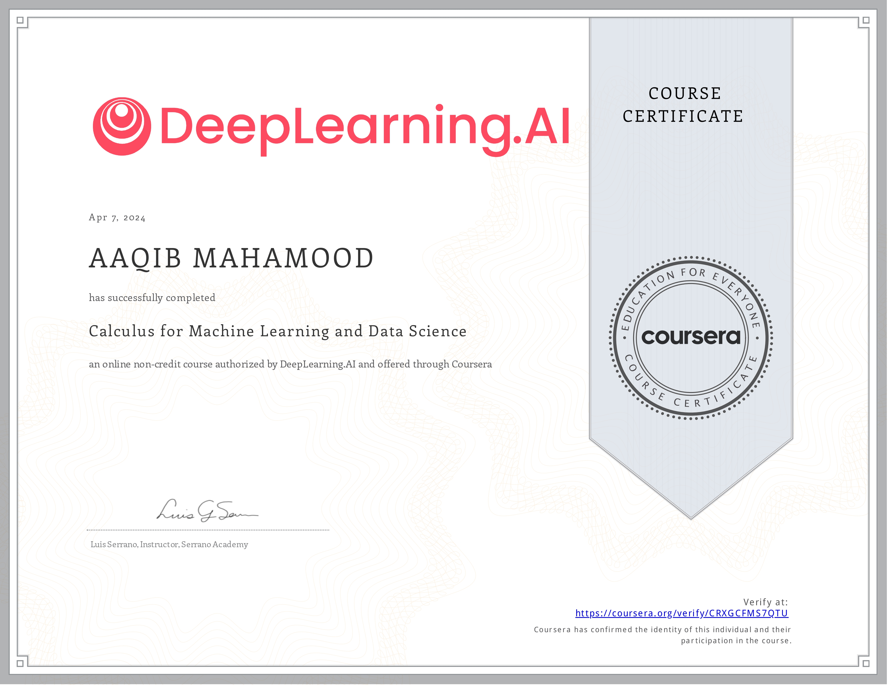
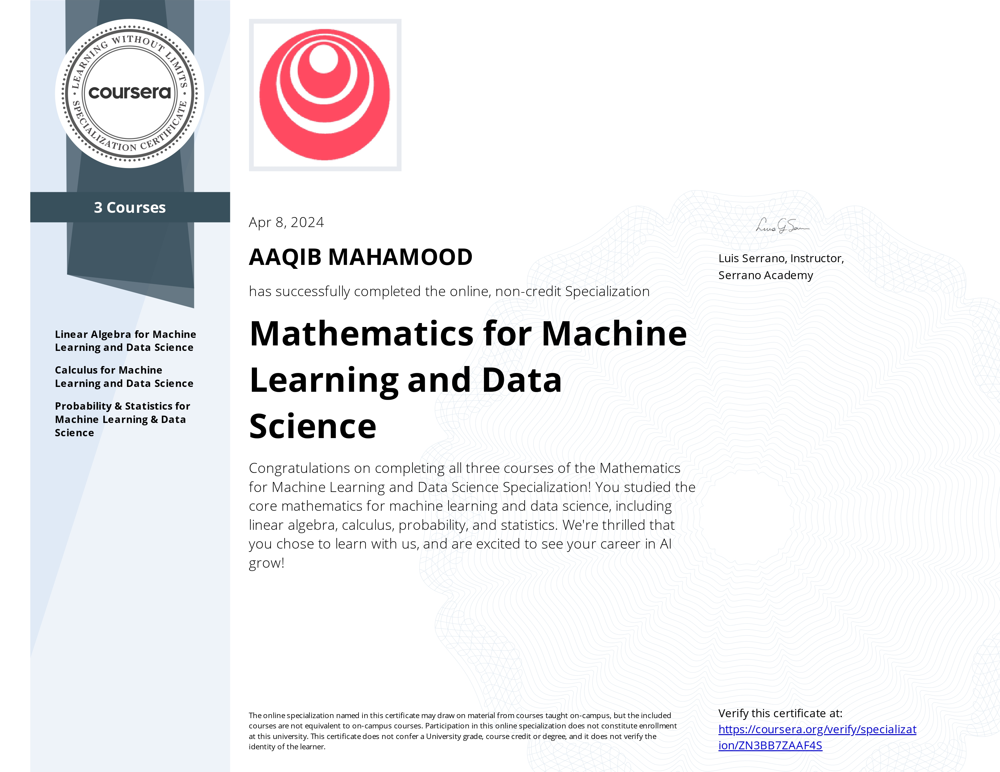

# Mathematics-for-Machine-Learning-and-Data-Science-Specialization-Coursera

Mathematics for Machine Learning and Data Science Specialization offered by deeplearning.ai , instructed by Luis Serrano on Coursera.

## Course 1 : [Linear Algebra for Machine Learning and Data Science](https://www.coursera.org/learn/machine-learning-linear-algebra)

### [Certificate Of Completion] (https://coursera.org/share/d7743c4cc1c3529b9de17eac2498fb9b)

## Course 2 : [Calculus For Machine Learning and Data Science](https://www.coursera.org/learn/machine-learning-calculus)
### [Certificate Of Completion](https://coursera.org/share/a1390032dbe67161334412158979b763)

## Course 3 : [Probability & Statistics for Machine Learning & Data Science](https://www.coursera.org/learn/machine-learning-probability-and-statistics)
### [Certificate Of Completion](https://coursera.org/share/59aa71fcc096c94de4a2dcad549ae2f4)

## [Specialization Certificate]([https://coursera.org/share/ea6107e80f98b4d1f05b9263413f39c6](https://coursera.org/share/8a4a3e438aafab73dc7943ec5cc22cdd))

