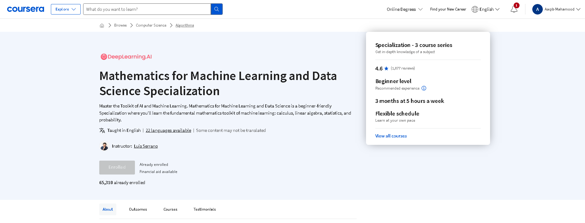

# Mathematics-for-Machine-Learning-and-Data-Science-Specialization-Coursera

Mathematics for Machine Learning and Data Science Specialization offered by deeplearning.ai , instructed by Luis Serrano on Coursera.

## Course 1 : [Linear Algebra for Machine Learning and Data Science](https://www.coursera.org/learn/machine-learning-linear-algebra)

 

### [Certificate Of Completion]([https://coursera.org/share/4dcac0c68e690f1947739cc62143dc78](https://coursera.org/share/d7743c4cc1c3529b9de17eac2498fb9b))

